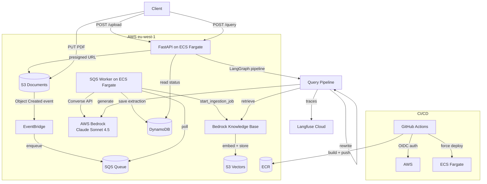

# Document Intelligence Pipeline

A production-grade document intelligence system built as a portfolio project for Berlin AI/backend engineering roles. Upload a PDF (invoice, contract, report) → Claude extracts structured data → query everything in natural language with citations.

**Live demo:** Deploy with `terraform apply` + set `desired_count = 1` → curl the task's public IP on port 8080.

---

## What It Does

1. **Upload** — client requests a presigned S3 URL; PDF lands in S3 and triggers an EventBridge event
2. **Extract** — SQS worker picks up the event, sends the PDF to Claude via Bedrock Converse API, saves structured JSON to DynamoDB
3. **Index** — worker triggers a Bedrock Knowledge Base ingestion job; the PDF is chunked, embedded (Titan Embed Text v2), and stored in S3 Vectors
4. **Query** — a three-node LangGraph pipeline rewrites the question, retrieves relevant chunks from the KB, and generates a grounded answer with citations; every step is traced in Langfuse

---

## Architecture



---

## Tech Stack

| Layer | Technology | Why |
|---|---|---|
| **API** | FastAPI + Python 3.12 | Async, typed, fast to iterate |
| **AI extraction** | Claude Sonnet 4.5 via AWS Bedrock Converse API | Structured JSON extraction from PDFs; cross-region inference profile for EU data residency |
| **Query pipeline** | LangGraph `StateGraph` | Explicit node graph (rewriter → retriever → generator); observable, debuggable, extensible |
| **Vector store** | AWS S3 Vectors + Bedrock Knowledge Base | ~$1/mo vs ~$176/mo for OpenSearch Serverless; native Bedrock integration |
| **Document store** | DynamoDB (single-table) | PK=`DOC#id`, SK=`METADATA`/`EXTRACTION`; GSI for status queries |
| **Queue** | SQS + DLQ | Decouples upload from extraction; 3-retry DLQ for failed jobs |
| **Events** | EventBridge → SQS | S3 upload triggers processing without polling |
| **Observability** | Langfuse v3 | Per-node traces for the LangGraph pipeline; pinned `>=3,<4` |
| **Secrets** | AWS SSM Parameter Store (SecureString) | Encrypted at rest; injected by ECS at container launch; free for static keys |
| **Container runtime** | ECS Fargate (no ALB) | Serverless containers; `desired_count=0` when idle = ~$0 cost |
| **Registry** | Amazon ECR | Private registry; vulnerability scanning on push |
| **IaC** | Terraform | All resources defined as code: S3, DynamoDB, SQS, EventBridge, Bedrock KB, S3 Vectors, ECR, ECS, IAM, SSM |
| **CI/CD** | GitHub Actions + OIDC | No stored AWS credentials; short-lived tokens via federated identity |
| **Package manager** | uv | 10–100× faster than pip; lockfile-based reproducible builds |

---

## Architecture Decision Records

### ADR-1: S3 Vectors over OpenSearch Serverless for vector storage

**Decision:** Use AWS S3 Vectors as the vector store backend for the Bedrock Knowledge Base.

**Context:** Bedrock Knowledge Base supports OpenSearch Serverless (the default) and S3 Vectors. The project needs semantic search over uploaded documents.

**Consequences:** S3 Vectors costs ~$1/month at portfolio scale. OpenSearch Serverless has a minimum cost of ~$176/month (two OCUs minimum). S3 Vectors has the same native Bedrock integration and is the right-sized choice for a document intelligence demo. If the project scaled to millions of documents with sub-10ms latency requirements, OpenSearch Serverless would earn its cost.

---

### ADR-2: Direct Bedrock extraction over AWS Textract

**Decision:** Send PDFs directly to Claude via the Bedrock Converse API for structured data extraction, without pre-processing through Textract.

**Context:** The project handles text-based PDFs (invoices, contracts, reports). Two extraction paths were considered: Textract (OCR + structured extraction) → Claude, or Claude directly.

**Consequences:** For text-layer PDFs, Claude reads the document natively without OCR. This eliminates Textract's per-page cost (~$0.015/page) and pipeline complexity. If the project needed to handle scanned/image-only PDFs, Textract would be reintroduced for the OCR step.

**Known caveat:** Bedrock's Converse API rejects filenames containing hyphens. Filenames are normalized (hyphens/underscores → spaces) before sending.

---

### ADR-3: ECS Fargate (no ALB) over App Runner

**Decision:** Deploy the containerized API on ECS Fargate with a direct public IP, without an Application Load Balancer.

**Context:** AWS App Runner was the original target (simpler managed platform, built-in HTTPS URL). On March 31, 2026, AWS closed App Runner to new customers. ECS Fargate was chosen as the replacement.

**Tradeoffs considered:**
- **Fargate + ALB:** Standard production setup, stable HTTPS URL, ~$16/month minimum for the ALB even when idle.
- **Fargate no-ALB:** Task gets a direct public IP on port 8080, IP changes on restart, no HTTPS. Cost: ~$0.05/hour while running, ~$0 when `desired_count = 0`.
- **Lightsail Containers:** Fixed ~$7/month, HTTPS included, but less transferable to production engineering contexts.

**Decision rationale:** For a portfolio project with occasional demo usage, paying ~$16/month for an idle load balancer is wasteful. The direct-IP pattern with `desired_count = 0` when not in use keeps costs near zero. The tradeoff (changing IP, no HTTPS) is acceptable for a demo context and is documented clearly.

**Operational pattern:** Scale to 1 before a demo, grab the task's public IP, demo, scale back to 0.

---

### ADR-4: SSM Parameter Store over Secrets Manager for API keys

**Decision:** Store Langfuse API keys in SSM Parameter Store (SecureString) rather than AWS Secrets Manager.

**Context:** The application needs two third-party API keys (Langfuse public and secret keys) injected at runtime.

**Consequences:** Both services provide KMS encryption at rest and IAM-controlled access. Secrets Manager adds automatic rotation (via Lambda), cross-region replication, and a generate-random-password API — none of which are relevant for static third-party API keys. SSM Parameter Store is free for standard parameters. Secrets Manager costs ~$0.40/secret/month. The rotation machinery in Secrets Manager would go unused; paying for it would be cargo-culting the more expensive service.

---

### ADR-5: OIDC over stored IAM credentials for GitHub Actions

**Decision:** Use OpenID Connect (OIDC) federation for GitHub Actions to authenticate to AWS, with no long-lived access keys stored in GitHub secrets.

**Context:** The CI/CD pipeline needs to push images to ECR and update the ECS service.

**Consequences:** GitHub exchanges a short-lived, signed OIDC token for temporary AWS credentials at workflow runtime. Credentials expire in minutes. The trust policy is scoped to `repo:yangull/doc-intelligence-pipeline:*`, so no other GitHub repository can assume the deploy role. This is strictly more secure than storing `AWS_ACCESS_KEY_ID` / `AWS_SECRET_ACCESS_KEY` as GitHub secrets, which are long-lived and harder to rotate.

---

### ADR-6: LangGraph for the query pipeline

**Decision:** Wrap the RAG query endpoint in a LangGraph `StateGraph` with three explicit nodes: `query_rewriter → retriever → generator`.

**Context:** The `/query` endpoint could be implemented as a simple sequential function. LangGraph was chosen instead.

**Consequences:** Each node is independently observable in Langfuse, independently testable, and independently replaceable. The explicit graph makes the pipeline's structure visible in code — an interviewer can read `query_graph.py` and immediately understand the data flow. The tradeoff is a small amount of boilerplate (`QueryState`, `StateGraph`, `add_node`/`add_edge`). For a portfolio project demonstrating AI engineering patterns, the explicitness is a feature.

---

## Local Development

### Prerequisites

- Python 3.12
- [uv](https://docs.astral.sh/uv/)
- AWS CLI configured with an IAM user that has access to Bedrock, S3, DynamoDB, SQS
- AWS account with Bedrock model access approved for Claude Sonnet in eu-west-1

### Setup

```bash
git clone https://github.com/yangull/doc-intelligence-pipeline.git
cd doc-intelligence-pipeline

# Create venv and install dependencies
uv sync

# Activate
source .venv/bin/activate

# Copy and fill in environment variables
cp .env.example .env
# Edit .env with your AWS region, queue URL, KB ID, Langfuse keys
```

### Environment Variables

```dotenv
AWS_REGION=eu-west-1
S3_BUCKET_NAME=doc-intelligence-documents-dev
DYNAMODB_TABLE_NAME=doc-intelligence-documents-dev
BEDROCK_MODEL_ID=eu.anthropic.claude-sonnet-4-5-20250929-v1:0
SQS_QUEUE_URL=https://sqs.eu-west-1.amazonaws.com/<account>/doc-intelligence-documents-dev
BEDROCK_KB_ID=<your-kb-id>
BEDROCK_KB_DATA_SOURCE_ID=<your-datasource-id>
LANGFUSE_PUBLIC_KEY=pk-lf-...
LANGFUSE_SECRET_KEY=sk-lf-...
LANGFUSE_BASE_URL=https://cloud.langfuse.com
```

### Running Locally

```bash
# Terminal 1: API server
uvicorn main:app --reload

# Terminal 2: SQS worker
python -m app.worker.worker
```

### API Endpoints

| Method | Path | Description |
|---|---|---|
| `GET` | `/health` | Health check |
| `POST` | `/api/v1/documents/upload` | Get presigned S3 URL + create PENDING record |
| `GET` | `/api/v1/documents/{id}/status` | Poll extraction status |
| `POST` | `/api/v1/documents/query` | Natural language query with citations |

---

## Infrastructure

All infrastructure is defined in `terraform/`. Requires Terraform >= 1.0 and an AWS account.

```bash
cd terraform
terraform init
terraform plan
terraform apply
```

### Deploying the App

The app ships as a Docker container. Build and push manually:

```bash
# Authenticate Docker to ECR
aws ecr get-login-password --region eu-west-1 | docker login --username AWS --password-stdin 549116506173.dkr.ecr.eu-west-1.amazonaws.com

# Build and push
docker build -t 549116506173.dkr.ecr.eu-west-1.amazonaws.com/doc-intelligence-dev:latest .
docker push 549116506173.dkr.ecr.eu-west-1.amazonaws.com/doc-intelligence-dev:latest
```

Or just push to `main` — GitHub Actions handles build + push + deploy automatically via OIDC.

### Starting / Stopping the Service

The ECS service runs with `desired_count = 0` by default (zero cost when idle).

**To start:**
```bash
# In terraform/main.tf, set desired_count = 1, then:
cd terraform && terraform apply

# Get the task's public IP
TASK=$(aws ecs list-tasks --cluster doc-intelligence-dev --region eu-west-1 --query 'taskArns[0]' --output text)
ENI=$(aws ecs describe-tasks --cluster doc-intelligence-dev --tasks $TASK --region eu-west-1 --query "tasks[0].attachments[0].details[?name=='networkInterfaceId'].value | [0]" --output text)
aws ec2 describe-network-interfaces --network-interface-ids $ENI --region eu-west-1 --query 'NetworkInterfaces[0].Association.PublicIp' --output text
```

**To stop:**
```bash
# In terraform/main.tf, set desired_count = 0, then:
cd terraform && terraform apply
```

---

## Project Structure

```
├── app/
│   ├── api/
│   │   └── documents.py        # upload, status, query endpoints
│   ├── core/
│   │   ├── config.py           # Settings (pydantic-settings)
│   │   └── aws_clients.py      # boto3 client factories
│   ├── pipeline/
│   │   └── query_graph.py      # LangGraph pipeline + Langfuse tracing
│   ├── schemas/
│   │   └── documents.py        # Pydantic models
│   └── worker/
│       ├── extractor.py        # Claude extraction + KB ingestion
│       └── worker.py           # SQS polling loop
├── terraform/                  # All AWS infrastructure as code
├── Dockerfile                  # Multi-stage build with uv
├── .github/workflows/
│   └── deploy.yml              # GitHub Actions CI/CD (OIDC + ECR + ECS)
└── pyproject.toml
```

---

## Build Status


